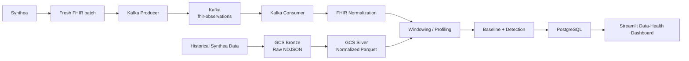

# Sentinel

**Sentinel** is a real-time data health monitoring project for healthcare data streams.

The main question behind the project is:

> **The pipeline is green — but is the data healthy?**

Sentinel uses synthetic FHIR healthcare data to simulate a live stream, monitors the quality and behavior of that stream, and is designed to detect issues such as null spikes, type changes, schema changes, and unusual volume patterns.

This README is mainly for the team: how to set up the project, start the infrastructure, generate/replay data, consume the stream, and continue each part of the pipeline.

---

## 1. Current Architecture



There are **two different data flows** in the project:

### Historical data

Used for exploration and reference distributions.

```text
Synthea
  → GCS Bronze
  → normalization
  → GCS Silver
```

### Simulated live data

Used to test Sentinel as a streaming system.

```text
Fresh Synthea generation
  → Kafka producer
  → Kafka
  → consumer
  → normalized rows
  → Sentinel monitoring components
```

Do **not** replay the historical GCS dataset as the live feed. The live simulator generates fresh Synthea batches.

---

## 2. What Is Already Implemented

The following parts are currently available:

- GCS ingestion for historical data
- FHIR Observation normalization
- Historical Bronze → Silver transformation
- Silver Parquet dataset in GCS
- Local Kafka broker through Docker Compose
- Kafka producer
- Kafka consumer
- Continuous Synthea generation + Kafka replay
- Tests for Observation normalization

The monitoring layer is the next stage:

```text
consumer
  → windows
  → profiler
  → baseline
  → detector
  → PostgreSQL
  → Streamlit
```

---

## 3. Repository Structure

The relevant structure should look similar to:

```text
sentinel/
├── docker-compose.yml
├── pyproject.toml
├── poetry.lock
├── .env.example
├── .envrc
│
├── src/
│   └── sentinel/
│       ├── ingestion/
│       │   ├── __init__.py
│       │   └── gcs.py
│       │
│       ├── transformation/
│       │   ├── __init__.py
│       │   ├── observations.py
│       │   └── build_silver.py
│       │
│       ├── streaming/
│       │   ├── __init__.py
│       │   ├── producer.py
│       │   ├── consumer.py
│       │   └── replay.py
│       │
│       └── baseline/
│           └── profiler.py
│
├── tests/
└── data/
    └── replay/          # local generated data; ignored by Git
```

`data/replay/` is temporary local data and should **not** be committed.

---

## 4. Prerequisites

Before starting, make sure you have:

- Git
- Docker Desktop
- Python 3.12
- Poetry
- Java available from the terminal
- Synthea `synthea-with-dependencies.jar`
- Google Cloud CLI if your task needs the historical GCS data

Check the main tools:

```bash
docker --version
python3 --version
poetry --version
java -version
```

---

## 5. Clone and Switch to `dev`

```bash
git clone <REPOSITORY_URL>
cd <REPOSITORY_FOLDER>

git checkout dev
git pull origin dev
```

Keep your work based on the latest `dev` branch.

---

## 6. Install Python Dependencies

```bash
poetry install
```

If the Poetry environment is not active, commands can always be run with:

```bash
poetry run <command>
```

---

## 7. Configure the Environment

Create your local `.env`:

```bash
cp .env.example .env
```

Then edit `.env`.

Example:

```env
# =========================
# Google Cloud
# =========================

GCP_PROJECT_ID=<project-id>
GCS_BUCKET=sentinel-fhir-data


# =========================
# PostgreSQL
# =========================

POSTGRES_DB=sentinel
POSTGRES_USER=sentinel
POSTGRES_PASSWORD=<local-password>
POSTGRES_HOST=localhost
POSTGRES_PORT=5433


# =========================
# Kafka
# =========================

KAFKA_BOOTSTRAP_SERVERS=localhost:9092
KAFKA_TOPIC=fhir-observations
KAFKA_CONSUMER_GROUP=sentinel-consumer-yourname


# =========================
# Synthea simulator
# =========================

SYNTHEA_JAR=/absolute/path/to/synthea-with-dependencies.jar

SYNTHEA_POPULATION=20
REPLAY_RATE=10
```

### Important

Never commit `.env`.

Each teammate must set their own `SYNTHEA_JAR` path.

For development, using a personal Kafka consumer group is useful:

```env
KAFKA_CONSUMER_GROUP=sentinel-consumer-yourname
```

For example:

```env
KAFKA_CONSUMER_GROUP=sentinel-consumer-shouq
```

This prevents developers from accidentally sharing Kafka offsets while testing against the same broker.

---

## 8. Optional: direnv

If you use `direnv` and `.envrc` contains:

```bash
dotenv
```

run:

```bash
direnv allow
```

The Python code also loads `.env`, so `direnv` is optional.

---

## 9. Start Kafka and PostgreSQL

Start the Docker services:

```bash
docker compose up -d
```

Check them:

```bash
docker compose ps
```

You should see the Kafka and PostgreSQL containers running.

Useful logs:

```bash
docker compose logs kafka
```

```bash
docker compose logs postgres
```

---

## 10. Create the Kafka Topic

The project uses:

```text
fhir-observations
```

Create it once if it does not already exist:

```bash
docker exec sentinel-kafka \
  /opt/kafka/bin/kafka-topics.sh \
  --create \
  --if-not-exists \
  --topic fhir-observations \
  --bootstrap-server localhost:9092 \
  --partitions 1 \
  --replication-factor 1
```

Confirm:

```bash
docker exec sentinel-kafka \
  /opt/kafka/bin/kafka-topics.sh \
  --list \
  --bootstrap-server localhost:9092
```

Expected:

```text
fhir-observations
```

---

## 11. Start the Continuous Live-Data Simulator

This is the easiest way to provide a continuous stream for development.

Run:

```bash
poetry run python -m sentinel.streaming.replay
```

The simulator repeatedly does:

```text
Generate a fresh Synthea batch
        ↓
Find Observation.ndjson
        ↓
Replay observations into Kafka
        ↓
Remove the temporary local batch
        ↓
Generate another batch
        ↓
Repeat
```

It continues until you stop it with:

```text
Ctrl+C
```

The speed can be changed in `.env`:

```env
REPLAY_RATE=10
```

This means approximately 10 FHIR Observation messages are published to Kafka per second.

The size of each fresh Synthea generation can also be changed:

```env
SYNTHEA_POPULATION=20
```

---

## 12. Consume the Kafka Stream

To test that messages are arriving:

```bash
poetry run python -m sentinel.streaming.consumer
```

The consumer:

1. reads FHIR Observation messages from Kafka,
2. parses the JSON,
3. calls `normalize_observation()`,
4. yields normalized rows.

A teammate writing downstream processing should normally **import the consumer**, rather than read the NDJSON file directly.

Example:

```python
from sentinel.streaming.consumer import consume_observations


for row in consume_observations():
    print(row)
```

A normalized row contains fields such as:

```python
{
    "observation_id": "...",
    "patient_id": "...",
    "encounter_id": "...",
    "parent_code": "85354-9",
    "parent_display": "Blood pressure panel with all children optional",
    "event_time": "...",
    "issued_time": "...",
    "status": "final",
    "code": "8480-6",
    "display": "Systolic Blood Pressure",
    "value_type": "numeric",
    "numeric_value": 128.0,
    "categorical_code": None,
    "categorical_display": None,
    "string_value": None,
    "unit": "mm[Hg]",
}
```

One FHIR Observation can produce multiple normalized rows. For example, a blood-pressure panel can produce separate systolic and diastolic rows.

---

## 13. How Downstream Components Should Use the Stream

The intended integration is:

```text
Kafka
  ↓
consume_observations()
  ↓
windowing
  ↓
profiling
  ↓
baseline comparison
  ↓
detection
  ↓
PostgreSQL
```

For example:

```python
from sentinel.streaming.consumer import consume_observations


def process_stream():
    for row in consume_observations():
        # Pass the normalized row to the next Sentinel component.
        process_row(row)
```

The Kafka consumer should remain focused on Kafka + normalization.

Do not put all profiling, detection, database, and dashboard logic inside `consumer.py`.

---

## 14. Windowing

Kafka produces a continuous stream.

It does **not** automatically create Sentinel's analysis windows.

The monitoring layer should decide how records are grouped, for example:

```text
10:00:00 ─┐
10:00:12  │
10:00:24  ├─ processing-time window
10:00:38  │
10:00:59 ─┘
             ↓
          profile
```

For the live stream, use **arrival/processing time** for operational windows.

Do not use the historical FHIR `event_time` as the clock for Kafka arrival-volume monitoring. A clinical event can have occurred years ago but arrive in Kafka now.

The earlier fixed 20-record historical windows were exploratory and are **not** the final streaming-window design.

---

## 15. Historical GCS Data

The existing historical data is separate from the live simulator.

### Bronze

Raw Synthea NDJSON:

```text
gs://sentinel-fhir-data/bronze/synthea/run_id=001/Patient.ndjson
gs://sentinel-fhir-data/bronze/synthea/run_id=001/Encounter.ndjson
gs://sentinel-fhir-data/bronze/synthea/run_id=001/Observation.ndjson
```

### Silver

Normalized Observation Parquet:

```text
gs://sentinel-fhir-data/silver/observations/run_id=001/observations.parquet
```

Silver uses a generalized long format with one measurable value per row.

The historical Silver dataset can be used for:

- exploration,
- understanding normal value distributions,
- selecting monitored signals,
- developing profiling logic,
- reference statistics.

The live Kafka stream should be used for:

- processing-time windows,
- live quality metrics,
- failure injection,
- drift detection,
- incidents.

---

## 16. Google Cloud Access

If your task needs Bronze or Silver data, authenticate locally:

```bash
gcloud auth login
```

Then configure Application Default Credentials for Python:

```bash
gcloud auth application-default login
```

Set the correct project:

```bash
gcloud config set project <project-id>
```

Your account must also have the required IAM permissions on the project/bucket.

If you receive a `403` or permission error, contact the project lead before changing the GCS code.

---

## 17. Run the Tests

Run:

```bash
poetry run pytest
```

Or:

```bash
poetry run pytest -v
```

The Observation normalization tests should pass before merging changes that touch:

```text
src/sentinel/transformation/observations.py
```

---

## 18. Suggested Local Development Workflow

A normal development session can use three terminals.

### Terminal 1 — infrastructure

```bash
docker compose up -d
```

### Terminal 2 — synthetic live feed

```bash
poetry run python -m sentinel.streaming.replay
```

### Terminal 3 — your Sentinel component

Examples:

```bash
poetry run python -m sentinel.streaming.consumer
```

or run the module you are currently developing.

The overall flow is:

```text
Terminal 2
Synthea → Kafka

Terminal 3
Kafka → your Sentinel component
```

---

## 19. Team Handoff Points

### Data-quality / drift work

Start from:

```python
from sentinel.streaming.consumer import consume_observations
```

Build:

```text
normalized stream
  → windows
  → metrics/profile
  → baseline
  → compare
  → detect
```

Typical data-health checks include:

- null-rate changes,
- unexpected data types,
- schema changes,
- record-volume changes,
- unexpected changes in value distributions.

Sentinel is monitoring **data health**, not diagnosing patients.

A clinically unusual value is not automatically bad data.

---

### PostgreSQL / incident management

PostgreSQL is intended to hold Sentinel's monitoring state / serving layer rather than replace GCS Silver.

Conceptually:

```text
GCS
  = historical/raw/normalized data

PostgreSQL
  = Sentinel monitoring state
```

Expected monitoring entities include:

- quality metrics,
- baselines,
- schema history,
- incidents,
- monitored resources/signals.

Coordinate the final schema with the detection logic before locking the tables.

---

### Streamlit dashboard

The dashboard is an **internal data-health dashboard**.

It should show things such as:

- current data-quality status,
- recent incidents,
- null-rate changes,
- volume behavior,
- schema changes,
- monitored signal metrics,
- baseline vs observed values.

It is **not** intended to be a patient-health dashboard.

The dashboard should primarily query the monitoring results stored in PostgreSQL.

---

## 20. Kafka Consumer Groups — Important

Kafka tracks progress using consumer-group offsets.

If two consumers use the **same group ID**, Kafka treats them as members of the same consumer group and may divide partitions/messages between them.

During independent development, use different group IDs if each developer needs to see the full stream.

Example:

```env
KAFKA_CONSUMER_GROUP=sentinel-consumer-yaqeen
```

```env
KAFKA_CONSUMER_GROUP=sentinel-consumer-norah
```

```env
KAFKA_CONSUMER_GROUP=sentinel-consumer-shouq
```

For the final integrated Sentinel application, use the agreed production group ID.

---

## 21. If the Consumer Looks Like It Is Doing Nothing

First make sure the simulator is running:

```bash
poetry run python -m sentinel.streaming.replay
```

Then check Kafka:

```bash
docker compose ps
```

If you already consumed all existing messages with the same consumer group, Kafka remembers that offset.

The easiest development fix is to temporarily use a new group:

```env
KAFKA_CONSUMER_GROUP=sentinel-consumer-yourname-v2
```

Restart the consumer afterward.

---

## 22. Common Commands

Start services:

```bash
docker compose up -d
```

Check services:

```bash
docker compose ps
```

Stop services:

```bash
docker compose down
```

Follow Kafka logs:

```bash
docker compose logs -f kafka
```

Run continuous Synthea replay:

```bash
poetry run python -m sentinel.streaming.replay
```

Run consumer:

```bash
poetry run python -m sentinel.streaming.consumer
```

Run tests:

```bash
poetry run pytest -v
```

Check the Kafka topics:

```bash
docker exec sentinel-kafka \
  /opt/kafka/bin/kafka-topics.sh \
  --list \
  --bootstrap-server localhost:9092
```

---

## 23. Git Workflow

Before starting work:

```bash
git checkout dev
git pull origin dev
```

Create your working branch:

```bash
git checkout -b feature/<short-name>
```

Example:

```bash
git checkout -b feature/drift-detection
```

Before opening a pull request:

```bash
git status
poetry run pytest
```

Do not commit:

```text
.env
.venv/
data/replay/
__pycache__/
*.pyc
.pytest_cache/
output.txt
output_test.txt
```

---

## 24. Quick Start

If everything has already been installed and configured:

```bash
git checkout dev
git pull origin dev

poetry install

docker compose up -d

poetry run python -m sentinel.streaming.replay
```

Then open another terminal and run your component.

For a quick Kafka test:

```bash
poetry run python -m sentinel.streaming.consumer
```

---

## 25. The Main Rule

Keep the boundaries between components clear:

```text
Synthea generation
      ↓
Kafka producer
      ↓
Kafka
      ↓
Kafka consumer
      ↓
FHIR normalization
      ↓
windowing
      ↓
profiling
      ↓
detection
      ↓
PostgreSQL
      ↓
Streamlit
```

Each part should have one clear responsibility.

That makes Sentinel easier to debug, test, integrate, and explain.
